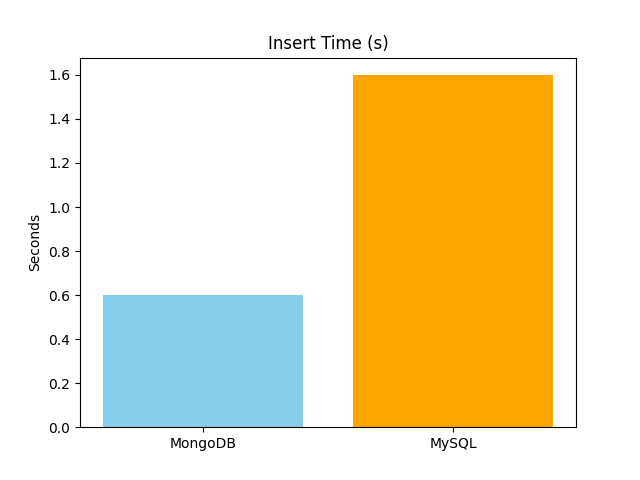
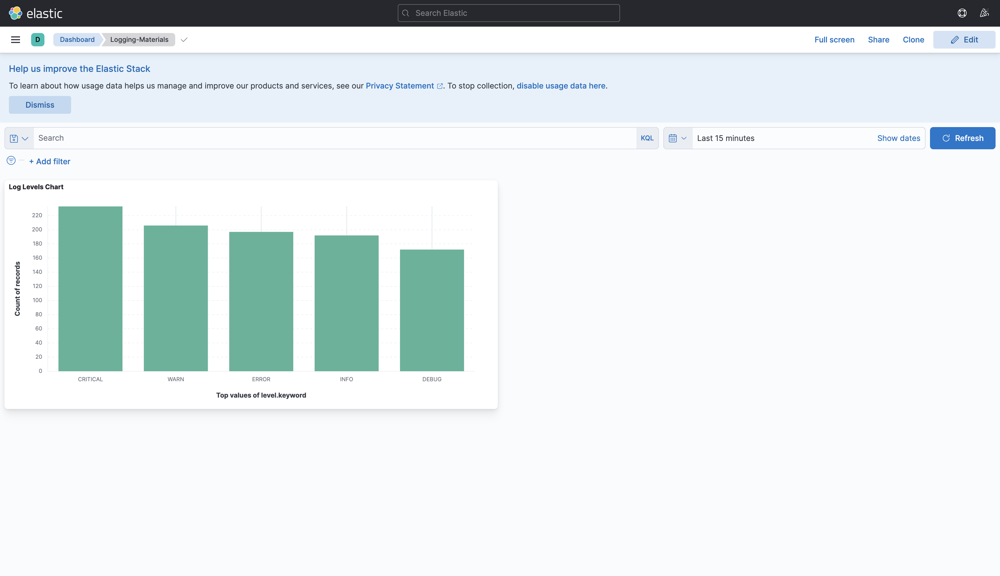

## 🧠 Project Description (ARM-Compatible)

This project is part of a technical research initiative titled:

**"Optimization of DevOps Log Persistence in NoSQL Databases: Comparative Approach and Technical Implementation"**

---

### 📌 Research Motivation

In modern DevOps pipelines, effective **log management** is critical for observability, performance monitoring, and incident tracing. As the volume of generated logs grows exponentially—especially in distributed microservices architectures—traditional SQL-based storage can face performance bottlenecks. This project investigates the potential of **NoSQL databases** for handling and analyzing DevOps logs efficiently.

---

### 🎯 Research Objectives

- **Design and implement** a logging infrastructure that integrates with a real microservices-based DevOps system using Docker and Jenkins.
- **Compare** NoSQL solutions with traditional SQL databases (PostgreSQL, MySQL) based on key performance metrics.
- **Deliver** a functional and reproducible system that includes both visualization and storage of real-time logs.

---

### 🛠️ Core Technologies

- **Microservices**: API Gateway, Auth, Patient, Analytics, Billing
- **CI/CD Orchestration**: Jenkins (on ARM architecture)
- **Infrastructure Services**: PostgreSQL, Kafka
- **Logging Stack**: Logstash → MongoDB, MySQL, Elasticsearch + Kibana

---

### 📊 Benchmark & Experimentation

The system measures and compares the following:
- **Log Ingestion Time**
- **Query Performance**
- **Resource Utilization** (CPU, RAM, Disk)

Test scenarios include:
- Real-time ingestion with Logstash + Elasticsearch
- Storage and retrieval from MongoDB and PostgreSQL
- Visualization with Kibana

---

### 📦 Deliverables

- 🧪 A working log management prototype with full pipeline integration.
- 📈 Performance benchmarks across SQL vs NoSQL storage backends.
- 📑 A structured technical report with results, architecture diagrams, and analysis.


## 🧩 System Architecture

The following diagram presents the overall architecture of the implemented solution.  
It showcases the flow from repositories through Jenkins pipelines to the Dockerized infrastructure, including both microservices and log persistence tools.


## 📈 Benchmark Workflow

This section explains the benchmarking process performed by the `log_comparison.py` script, which evaluates the performance of different NoSQL and SQL storage systems within the logging pipeline.

### 🔧 Workflow Summary

The benchmarking process simulates the real-world behavior of log ingestion, processing, and querying across a DevOps pipeline. It is structured into three key phases:

---

### 1. 🛠️ Log Generation & Ingestion

- The script generates a configurable number of **synthetic log entries** (e.g., 1000) with random log levels (`INFO`, `DEBUG`, `ERROR`, etc.).
- Each log is **sent as a JSON payload via HTTP** to the local **Logstash** container using its HTTP input plugin on port `9502`.
- Logstash processes these logs and forwards them to two destinations:
    - **Elasticsearch**: for indexing and visualization.
    - **A local JSON file** (`logs.json`): stored via file output in a mounted volume.

---

### 2. 📥 Log Extraction & Database Benchmark

- Once `logs.json` is available, the script **copies the file locally** and parses its contents.
- Then, it performs two operations **for both MongoDB and MySQL**:
    - **Insert Benchmark**: Insert all parsed logs into each database, measuring:
        - Execution time
        - CPU usage
        - Memory usage
    - **Query Benchmark**: Execute a basic read operation (e.g., count documents/rows), again measuring the same metrics.
- During both phases, resource usage is measured using Docker's stats API.

---

### 3. 📊 Result Generation

- All metrics are saved to a **timestamped benchmark report** in `.txt` format.
- Additionally, the script generates four **PNG charts** for visual comparison:
    - Insert Time (MongoDB vs MySQL)
    - Query Time
    - CPU Usage
    - Memory Usage

These results offer a **clear comparison between SQL and NoSQL approaches** to DevOps log persistence, helping determine which system is best suited for your logging architecture.

---

### 🧪 Technologies Used

- **MongoDB**: NoSQL document store for logs
- **MySQL**: Relational database for structured logs
- **Logstash**: Central log ingestion point
- **Elasticsearch + Kibana**: Visualization and search
- **Docker**: Isolated containerized benchmarking
- **Matplotlib**: For generating charts

This setup enables reproducible performance testing and helps guide infrastructure decisions for scalable DevOps logging systems.


## 🧪 Step-by-Step Tutorial

This section provides detailed instructions to set up, run, and evaluate the system described in this project.

---

### 🗂️ 1. Repositories Setup

You must create **separate GitHub repositories** for each of the following services:

#### 🔹 Microservices
- `api-gateway`
- `auth-service`
- `patient-service`
- `analytics-service`
- `billing-service`

#### 🔹 Infrastructure
- `infrastructure` — contains:
    - PostgreSQL databases (`auth-db`, `patient-db`)
    - Kafka configuration

#### 🔹 Logging Stack
- `logging-materials` — contains:
    - `logstash`
    - `elasticsearch`
    - `kibana`
    - `mongodb`
    - `mysql`

❗ **Do not include the following folders when publishing:**
- `host-logs`
- `local-log-comparison`

These directories are meant to run locally later in the benchmark phase.

---

### ⚙️ 2. Jenkins Pipeline Setup

1. Make sure **Jenkins** is installed on your machine and can access Docker.
2. Inside the `jenkins-pipelines/` folder, you will find a Jenkinsfile for each repository.
3. For each repository (auth-service, api-gateway, etc.):
    - Create a Jenkins job
    - Link it to the corresponding GitHub repo
    - Copy the appropriate Jenkinsfile from `jenkins-pipelines/`
    - Run the job

This will build the containers and start the services using Docker.

---

### 💻 3. Local Benchmark Setup

Once the services are up and running, proceed with benchmarking:

#### 📁 a. Prepare Local Directories

1. Create a directory on your machine (e.g., `~/log-benchmarking`)
2. Copy the following folders into it:
    - `host-logs`
    - `local-log-comparison`

#### 🐍 b. Set Up Python Environment (MacBook M4 ARM architecture)

Run the following commands in your terminal:

```bash
cd local-log-comparison
python3 -m venv venv
source venv/bin/activate
```

## 📊 Benchmark Results

After executing the benchmark script using:

```bash
python log_comparison.py
```

You will see the following console output:

```
🚀 Sending logs...
📥 Inserting...
🔎 Querying...

✅ Benchmark complete. Results saved to benchmark_results_2025-04-23_16-03-00.txt and PNG charts generated.
```

---

### 📄 Raw Benchmark File

```
=== INSERTION RESULTS ===
| Storage   |   Log Count | Insert Time   | CPU   | Memory   |
|-----------|-------------|---------------|-------|----------|
| MongoDB   |       12745 | 0.60s         | 4.55% | 271.25MB |
| MySQL     |       12745 | 1.60s         | 5.9%  | 523.03MB |

=== QUERY RESULTS ===
| Storage   | Query Time   | CPU   | Memory   |
|-----------|--------------|-------|----------|
| MongoDB   | 0.11s        | 0.61% | 271.16MB |
| MySQL     | 0.04s        | 0.23% | 527.38MB |
```

---

### 📊 Performance Visualizations

#### 🟦 Insert Time (s)


#### 🟩 CPU Usage (%)


#### 🟪 Memory Usage (MB)


#### 🟧 Query Time (s)


---

### 📌 Interpretation

- **MongoDB** is faster and lighter during **insertion**.
- **MySQL** executes **queries slightly faster**, but with noticeably higher memory consumption.
- MongoDB offers a more **balanced and consistent performance profile** for DevOps log persistence, particularly beneficial in memory-constrained ARM environments.

Here's a **Markdown-formatted Kibana Visualization section** you can paste directly into your `README.md`. It guides the reader step-by-step through the process of creating a chart using Kibana's Lens editor with the visuals you've uploaded.

---

## 📊 Visualizing Logs in Kibana

Once logs are indexed by Elasticsearch via Logstash, you can build dashboards in **Kibana** (`http://localhost:5601`) to monitor log levels and activity in real-time.

Follow these steps to build a log-level distribution chart:

---

### 🔹 Step 1: Create an Index Pattern

1. Go to **Stack Management → Index Patterns**  
2. Click **Create Index Pattern**
3. Set the pattern name as:

```
microservices-*
```

4. Choose `@timestamp` as the time field  
5. Click **Create index pattern**

📸 Example:  


---

### 🔹 Step 2: Confirm Mapped Fields

Search for `level` in the fields list to verify logs include the `level` field (INFO, ERROR, WARN, etc.).

📸 Example:  


---

### 🔹 Step 3: Create a Visualization

1. Go to **Visualize Library → Create**
2. Select **Lens**

📸 Example:  


---

### 🔹 Step 4: Build the Chart

1. Choose your index pattern: `microservices-*`
2. Set:
   - **Horizontal Axis**: `Top values of level.keyword`
   - **Vertical Axis**: `Count of records`
3. This creates a bar chart showing log counts by level (ERROR, INFO, etc.)

📸 Example:  

---

### 🔹 Step 5: Save to Dashboard

1. Click **Save**
2. Set title: `Log Levels Chart`
3. Add to your existing dashboard or create a new one

📸 Example:  

---

### 🖥️ Final Output

Your chart is now part of a Kibana dashboard and reflects real-time log activity across services.

📸 Example:  

---

This visualization allows you to monitor log distribution by severity across all microservices — a key insight for DevOps teams.

## ✅ Conclusion

This project provides a complete, ARM-compatible DevOps infrastructure that demonstrates how microservices can be monitored and benchmarked through an integrated log persistence pipeline.

---

### 🧩 What We Built

- A **multi-service architecture** deployed using Docker and orchestrated through Jenkins pipelines.
- A full **logging and monitoring stack** with Logstash, Elasticsearch, Kibana, MongoDB, and MySQL.
- A **benchmarking module** that evaluates log persistence performance in both SQL and NoSQL databases.
- A **Kibana dashboard** for real-time log visualization and severity monitoring.

---

### 🧪 What We Measured

- **Insertion Time**, **Query Time**, **CPU Usage**, and **Memory Consumption** for each storage engine.
- **Comparative insights** on MongoDB vs. MySQL efficiency in log-heavy systems.

---

### 🧠 Key Learnings

- NoSQL systems like MongoDB offer **faster inserts and better resource efficiency** for high-volume log ingestion.
- SQL databases like MySQL still perform **better for queries**, though with higher memory overhead.
- A hybrid architecture leveraging both types of databases can provide **flexibility depending on workload focus**.

---

### 🚀 Why This Matters

This solution helps DevOps engineers:
- Evaluate infrastructure choices based on **real-world benchmarks**.
- Build scalable and observable systems from the ground up.
- Understand the trade-offs between modern data storage options for log analytics.

Whether for **academic exploration**, **production benchmarking**, or **learning DevOps tooling**, this project provides a reproducible and extensible foundation.
